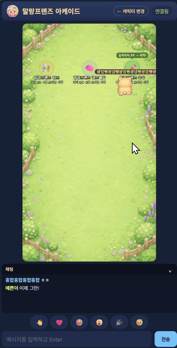

# 말랑프렌즈 아케이드

로그인 없이 방 코드나 광장에서 바로 모여 즐기는 웹 미니게임 아케이드.
오픈소스 기반 멀티플레이 플랫폼을 제공하며, 게임 개발에 참여하실 분 환영합니다.

## 바로 플레이

[https://web-game-lab.powerstrong.workers.dev/](https://web-game-lab.powerstrong.workers.dev/)

## 게임 목록

| 게임 | 인원 | 방식 |
|------|------|------|
| [말랑프렌즈 점프](./docs/games/jump-climber.md) | 1~2명 | 로컬 동시 플레이 |
| [말랑프렌즈 퀴즈배틀(공사중)](./docs/games/mallang-quiz-battle.md) | 2~6명 | 온라인 실시간 |
| [말랑프렌즈 쓱쓱](./docs/games/sseuk-sseuk.md) | 2~6명 | 온라인 실시간 |

## 기여하기

새 게임을 만들거나 버그를 고치고 싶다면:

- **[CONTRIBUTING.md](./CONTRIBUTING.md)** — 기여 흐름 한눈에 보기
- **[docs/ADD_GAME.md](./docs/ADD_GAME.md)** — 게임 추가 단계별 매뉴얼 (사람·AI 도구 모두 그대로 활용 가능)

`games/_template/` 복사 → 개발 → registry에 DRAFT 등록 → PR 흐름입니다.

## 참여 & 연락

같이 만들어보고 싶으신가요? 아래로 가볍게 인사만 남겨 주세요. 관리자가 확인하고 답을 드립니다.

- 🙋 **[참여 문의 / 자기소개](https://github.com/powerstrong/mallang-friends-arcade/issues/new?template=join.yml)** — 어떤 걸 해보고 싶은지, 개발 경험, 쓰는 AI 툴 정도만 적어주시면 됩니다 (초보·취미 환영).
- 🐛 버그 신고 · 💡 게임 제안도 [이슈](https://github.com/powerstrong/mallang-friends-arcade/issues/new/choose)에서 받습니다.

## 기술 스택

순수 HTML/CSS/JavaScript (빌드 도구 없음) · Cloudflare Workers + Durable Objects · Cloudflare Pages 자동 배포

## 라이선스

코드: [MIT License](./LICENSE)  
말랑프렌즈 캐릭터·브랜드 에셋: [ASSET_POLICY.md](./ASSET_POLICY.md)
