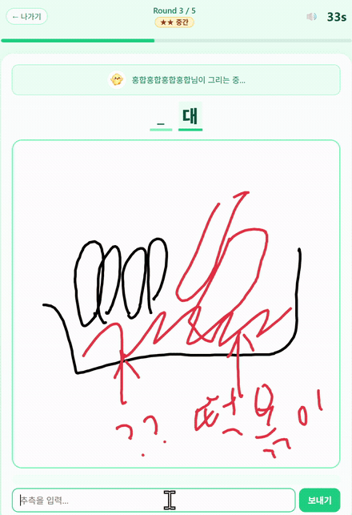

# 말랑프렌즈 쓱쓱

한 명이 그림을 그리면 나머지가 채팅으로 정답을 맞히는 온라인 실시간 그림 게임입니다.

---

## 기본 정보

| 항목 | 내용 |
|------|------|
| 인원 | 2~6명 |
| 플레이 방식 | 온라인 실시간 |
| 상태 | PLAYABLE |
| 제작자 | powerstrong |

---

## 플레이 방법

1. 광장에서 쓱쓱 부스에 들어가거나, 방 코드로 직접 입장합니다.
2. 2명 이상이 모이면 게임이 시작됩니다.
3. 매 라운드 한 명이 출제자, 나머지는 맞히는 사람이 됩니다.
4. **출제자**: 제시어를 보고 캔버스에 그림을 그립니다. 글자·숫자는 쓸 수 없습니다.
5. **맞히는 사람**: 채팅창에 답을 입력합니다. 정답이면 점수를 얻습니다.
6. 빨리 맞힐수록 점수 보너스가 있습니다.
7. 모든 라운드가 끝나면 최종 점수 순위가 공개됩니다.

---

## 조작

- **출제자 (모바일)**: 손가락으로 캔버스에 그리기
- **출제자 (PC)**: 마우스로 캔버스에 그리기
- **맞히는 사람**: 채팅창에 텍스트 입력

---

> 플레이는 [말랑프렌즈 아케이드](../../README.md) 광장에서 부스로 입장해 주세요. (2명 이상 모이면 시작)
